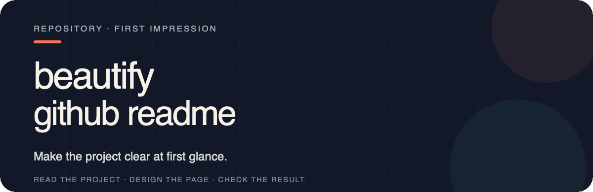

<p align="right">
  <a href="./README.md">English</a> · <a href="./README.zh-CN.md">简体中文</a> · <strong>日本語</strong>
</p>

<p align="center">
  
</p>

<p align="center">
  
</p>

<p align="center">
  
</p>

これらは架空のテンプレートではありません。この手法はすでに 6 つの公開リポジトリで使われており、それぞれが独自のビジュアル言語とコンテンツ構成を備えています。

- **[oil-ppt](https://github.com/oil-oil/oil-ppt)** — プログラムによるスライド作成の手法、成果、最初の利用手順を、一つのビジュアルシステムで提示します。
- **[draw-ui](https://github.com/oil-oil/draw-ui)** — 実際の UI 出力を使い、要件と参照画像から HTML/CSS を再構築するまでの流れを説明します。
- **[oil-icon](https://github.com/oil-oil/oil-icon)** — 実際のアイコンセットを使い、スタイルの固定、バッチ生成、切り出し、透明背景での納品を説明します。
- **[Selector](https://github.com/oil-oil/selector)** — ページ選択、構造化されたコンテキスト、実際の出力を、冒頭画面と例に直接配置します。
- **[codex-dev-team](https://github.com/oil-oil/codex-dev-team)** — キャラクターを使ったチームマップにより、一つの Codex メインスレッドが探索、範囲を限定した実装、独立レビューを 4 つのカスタムエージェントへ委任する方法を説明します。
- **[torqueDASH-Next](https://github.com/moesix/torque-dash-next)** — OBD-II PID データを使ったプロジェクト固有の SVG ヒーローと実際のダッシュボード画面により、セルフホスト型の車両テレメトリーダッシュボードを紹介します。

この Skill を使って公開したいと思える README を作成できた場合は、PR でこの一覧への追加を提案できます。これは完全に任意です。フッターへの署名は歓迎されますが必須ではなく、掲載の提案は引き続きメンテナーの審査対象です。

以下は、それぞれ独立した 4 種類のヒーローデザインです。共通の画一的なスタイルは使わず、タイポグラフィ、色、構図、根拠となる情報を各プロジェクト自体から導き出しています。

<p align="center">
  
</p>

<p align="center">
  
</p>

<p align="center">
  
</p>

<p align="center">
  
</p>

<p align="center">
  
</p>

ほとんどのリポジトリには、すでに十分な情報があります。多くの場合、問題はその順序です。訪問者はプロジェクトの目的を理解する前に、内部用語、インストールコマンド、ディレクトリツリーを目にします。

`beautify-github-readme` はまず実際のリポジトリを読み、最も明確な価値と根拠を特定してから、ページの見た目を決めます。

<p align="center">
  
</p>

README 全体モードでは、次の 3 つの層を横断して作業します。

| コンテンツ | ビジュアルシステム | エンジニアリング |
| --- | --- | --- |
| 重複を削除し、根拠を前へ移し、内部用語を具体的な成果に置き換える | ヒーローや補助モジュールを設計する前に、色、タイポグラフィ、構図、プロジェクト固有のモチーフを導き出す | アセットを GitHub 対応に保ち、画像をアクセシブルにし、コマンドをコピー可能に、本文を検索可能にする |

異なるプロジェクトに同じテンプレートを当てはめることはありません。CLI ならコマンドのリズムやカーソル、アイコンシステムならキーラインや切り抜き、研究リポジトリなら座標、チャート、根拠ラベルを利用できます。

<p align="center">
  
</p>

GitHub README には、Web サイトほど自由なレイアウト機能がありません。この Skill はビジュアル層とコンテンツ層を分離します。

- SVG は、編集可能なヒーロー、セクションの区切り、比較、図、アイデンティティを担当します。
- GIF は承認されたモーションを担当し、静的な SVG は編集可能なフォールバックとして残します。
- モーションはオプトインで、デフォルトでは生成しません。
- PNG/WebP は、スクリーンショット、生成画像、複雑なショーケースウォールを担当します。
- Markdown は、説明、コマンド、リンク、設定、コントリビューションの詳細を担当します。

その結果、検索、コピー、保守のできない一枚の長い画像にすることなく、設計されたページに仕上げられます。

再利用可能な制作ガイドは次の場所にあります。

- [プロジェクト固有のヒーローを設計する](./skills/beautify-github-readme/references/project-native-hero.md)
- [GitHub 対応の README SVG を作成する](./skills/beautify-github-readme/references/svg-production.md)
- [GitHub 対応の README モーションを制作する](./skills/beautify-github-readme/references/motion-production.md)

<p align="center">
  
</p>

このプロセスでは、実際のプロジェクト素材を使う、機能を捏造しない、明示的な承認なしに公開しない、という 3 つの約束を守ります。

<p align="center">
  
</p>

**方法 1 · コマンドラインからインストール**

```bash
npx skills add oil-oil/beautify-github-readme
```

**方法 2 · エージェントにインストールを依頼**

```text
この Skill をインストールしてください：https://github.com/oil-oil/beautify-github-readme
```

この Skill には、明確に分けられた 2 つのモードがあります。

| モード | 変更するもの | デフォルトで変更しないもの |
| --- | --- | --- |
| README 全体 | 読む順序、文章の階層、根拠、Markdown、完全なビジュアルシステム | 承認なしにコミット、プッシュ、公開しない |
| アセットのみ | 静的 SVG ヒーロー、セクションヘッダー、ワークフロー、バッジ、図、または SVG ソース付きの任意の GitHub 対応 GIF | README の文章、順序、画像参照、リンクを編集しない |

依頼に範囲が明記されている場合、Skill はそのまま作業を開始します。ユーザーが「このリポジトリを美しくして」とだけ伝えた場合やリポジトリ URL だけを渡した場合、エージェントは次のように確認します。

```text
README 全体を改善しますか、それともビジュアルアセットだけを作成しますか？
アセットのみの場合、ヒーロー、セクションヘッダー、ワークフロー、バッジ、モーショングラフィック、または一式のどれが必要ですか？
```

**README 全体モード**

```text
$beautify-github-readme を使い、実際のプロジェクトテーマを軸にこのリポジトリのホームページを再設計してください。
まずローカルプレビューを見せ、何もプッシュしないでください。
```

**アセットのみモード**

```text
$beautify-github-readme を使い、README は変更せず、SVG ソース付きのアニメーション GIF ヒーローを 1 つ作成してください。
既存のプロジェクトからスタイルを導き出し、まずレンダリングしたプレビューを見せてください。
```

コンテキストを得るために README を読んでも、それを編集する許可を得たことにはなりません。アセットのみモードで新しいアセットを埋め込むには、別途明示的な承認が必要です。

読み取り専用の監査も依頼できます。

```text
$beautify-github-readme を使い、この README の明確さ、階層、信頼性、保守コストを監査してください。ファイルは編集しないでください。
```

README 全体モードでは、ローカルプレビュー、ビジュアルアセット、README の差分を提供します。アセットのみモードでは、ソースアセット、レンダリング済みプレビュー、任意の GIF 派生物、埋め込みスニペットを提供します。コミット、プッシュ、PR、公開には必ず明示的な承認が必要です。

MIT License

---

この README 自体も実用例です。プロジェクト固有のヒーロー、テーマウォール、実際の採用実績、セクションの切り替え、読みやすい Markdown を組み合わせ、ページ全体を一枚のラスター画像にはしていません。
