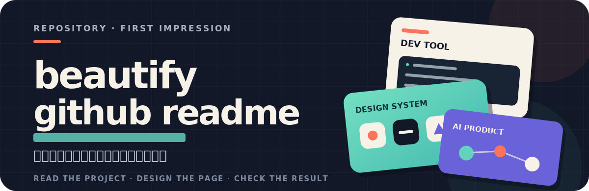
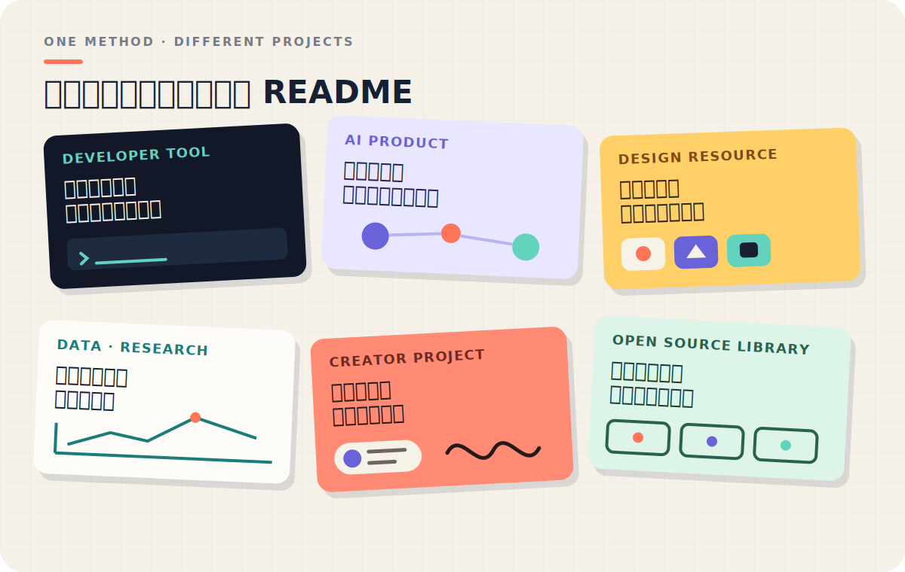
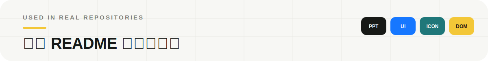
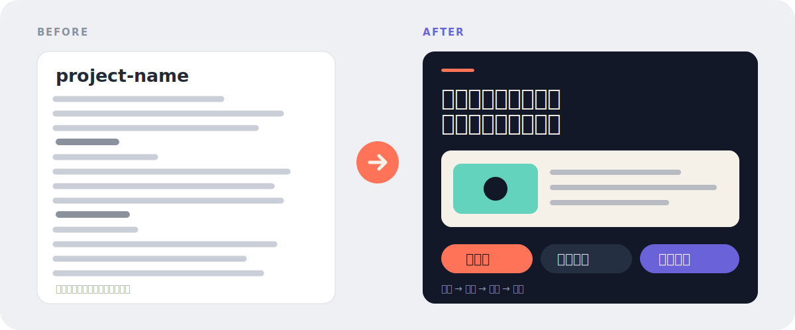
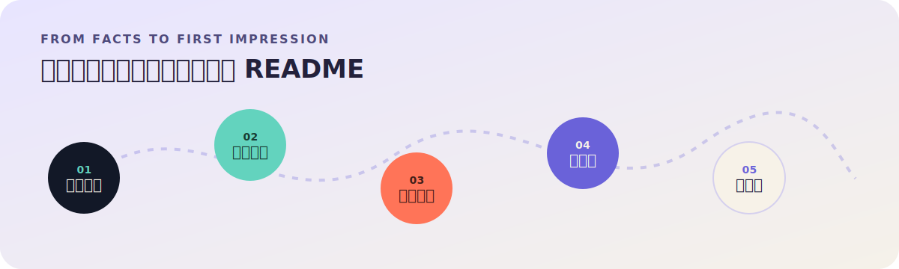

<p align="center">
  
</p>

<p align="center">
  
</p>

<p align="center">
  
</p>

这不是一组假想模板。下面三个仓库的 README 已经用这套方法重新整理过，每个项目保留自己的视觉语言和内容结构：

- **[oil-ppt](https://github.com/oil-oil/oil-ppt)** · 把程序化 PPT 的方法、效果和使用路径放在同一套视觉系统里。
- **[draw-ui](https://github.com/oil-oil/draw-ui)** · 用真实 UI 设计稿解释从需求、参考图到 HTML/CSS 还原的过程。
- **[Selector](https://github.com/oil-oil/selector)** · 把网页选取、结构化上下文和实际输出直接放进首屏与示例。

下面是四个独立的标题示例。它们不共用同一种风格，只根据项目本身决定字体、颜色和右侧放什么。

<p align="center">
  
</p>

<p align="center">
  
</p>

<p align="center">
  
</p>

<p align="center">
  
</p>

<p align="center">
  
</p>

很多仓库的信息其实已经够了，只是没有排好顺序。访客一上来看到内部术语、安装命令和目录结构，却还不知道这个项目是做什么的。

`beautify-github-readme` 会先把项目看懂，再决定什么应该放在前面、什么可以往后放。我们先把项目说清楚，再去做视觉。

<p align="center">
  
</p>

它会同时处理三件事：

| 内容 | 视觉 | 工程 |
| --- | --- | --- |
| 删除重复表述，效果前置，把术语换成更好懂的话 | 从项目本身找到配色、字体和图形语言，再设计 SVG 首屏与展示图 | 保持 GitHub 兼容、图片可访问、命令可复制、正文可搜索 |

不同项目不会得到同一张模板。终端工具可以使用命令节奏与光标，图标系统可以使用网格与切片，研究项目可以使用坐标、图表和证据标签。

<p align="center">
  
</p>

GitHub README 不能像网站一样自由使用 CSS。这个 Skill 把视觉层做成响应式 SVG，把真正需要阅读、复制和维护的内容留在 Markdown：

- SVG 负责首屏、章节、比较、流程和品牌感。
- PNG/WebP 负责截图、生成图片和复杂作品墙。
- Markdown 负责解释、命令、链接、配置和贡献说明。

这样做，页面可以有完整的设计，也不会变成一张不能搜索、不能维护的长图。

具体怎么从项目内容设计标题、怎么写这些 SVG，已经整理成两份可以直接照着执行的规范：

- [怎么从项目内容设计标题](./skills/beautify-github-readme/references/project-native-hero.md)
- [README SVG 的写法](./skills/beautify-github-readme/references/svg-production.md)

<p align="center">
  
</p>

整个过程只守三件事：使用真实内容、不编造产品能力、没有确认就不推送。

<p align="center">
  
</p>

**方式一 · 执行命令**

```bash
npx skills add oil-oil/beautify-github-readme
```

**方式二 · 直接交给 Agent**

把下面这句话发给 Agent：

```text
请安装这个 Skill：https://github.com/oil-oil/beautify-github-readme
```

安装之后，提供仓库路径或 GitHub 链接就可以开始：

```text
[$beautify-github-readme] 帮我重新设计这个仓库的 GitHub 主页，
风格根据项目主题决定。先给我本地预览，不要推送。
```

也可以只使用其中一种能力：

```text
[$beautify-github-readme] 只审查这个 README，告诉我哪里难懂。
```

```text
[$beautify-github-readme] 保留现有文字，只重新设计 SVG 首屏和章节标题。
```

```text
[$beautify-github-readme] 把这些真实截图组成一张有秩序的斜向作品墙。
```

默认交付本地预览、视觉素材和 README diff。只有在明确授权后，才会提交、推送或创建 PR。

MIT License

---

这份 README 也是一个实际示例。我们在同一页里用了深色首屏、多主题展示、前后对比、流程图和三种章节容器，同时把需要复制和阅读的内容留在 Markdown 里。
