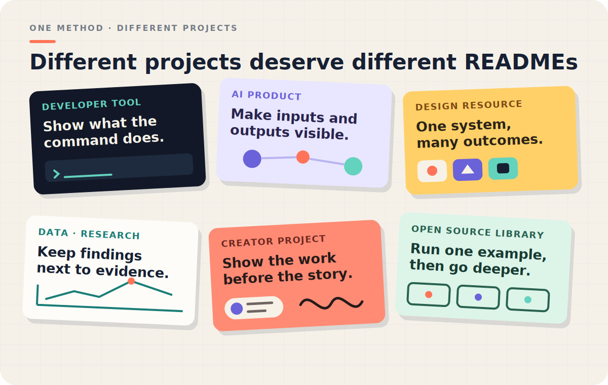
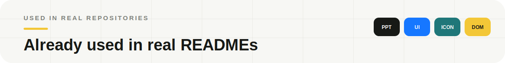
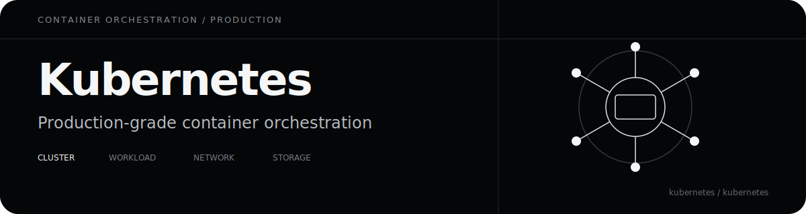
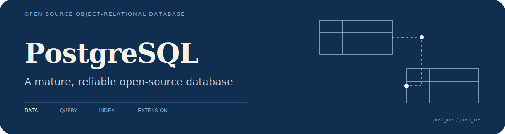
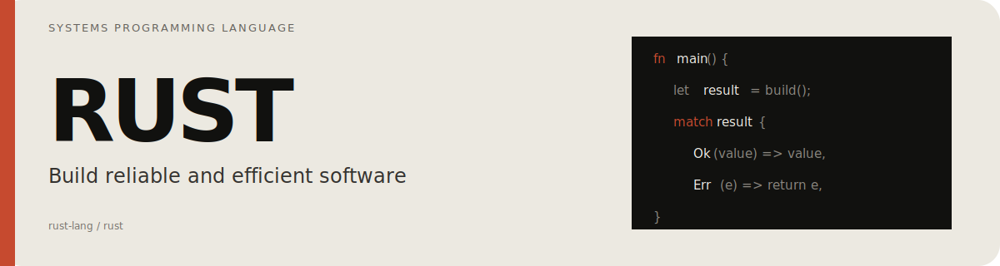
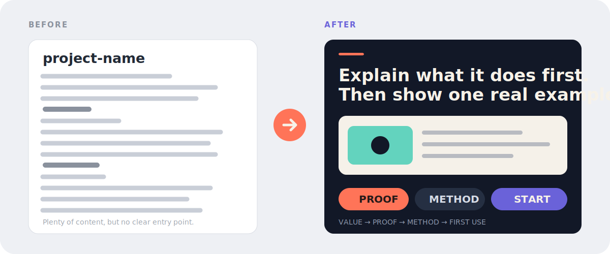
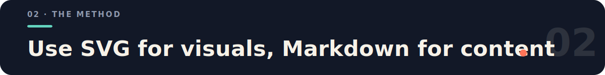
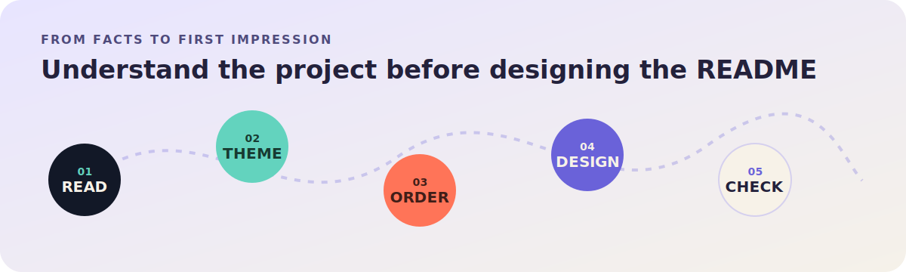

<p align="right">
  <strong>English</strong> · <a href="./README.zh-CN.md">简体中文</a>
</p>

<p align="center">
  
</p>

<p align="center">
  
</p>

<p align="center">
  
</p>

These are not hypothetical templates. The method is already used by four public repositories, each with its own visual language and content structure:

- **[oil-ppt](https://github.com/oil-oil/oil-ppt)** — presents the method, results, and first-use path for programmatic slide creation in one visual system.
- **[draw-ui](https://github.com/oil-oil/draw-ui)** — uses real UI outputs to explain the path from a brief and reference images to HTML/CSS reconstruction.
- **[oil-icon](https://github.com/oil-oil/oil-icon)** — uses real icon sets to explain style locking, batch generation, slicing, and transparent delivery.
- **[Selector](https://github.com/oil-oil/selector)** — puts page selection, structured context, and real output directly into the opening screen and examples.
- **[torque-dash-next](https://github.com/moesix/torque-dash-next)** — uses a project-native SVG hero with OBD-II PID data and a real dashboard screenshot to explain a self-hosted vehicle telemetry dashboard.

If this Skill helped you create a public README you are proud of, you are welcome to propose it for this list in a PR. This is completely optional: the footer signature is appreciated but never required, and showcase submissions remain subject to maintainer review.

Below are four independent hero directions. They do not share one house style; each derives its typography, color, composition, and proof from the project itself.

<p align="center">
  
</p>

<p align="center">
  
</p>

<p align="center">
  
</p>

<p align="center">
  
</p>

<p align="center">
  
</p>

Most repositories already contain enough information. The problem is usually the order: visitors see internal terminology, installation commands, and directory trees before they understand what the project is for.

`beautify-github-readme` reads the real repository first, identifies the clearest value and proof, and only then decides how the page should look.

<p align="center">
  
</p>

In whole-README mode, it works across three layers:

| Content | Visual system | Engineering |
| --- | --- | --- |
| Remove repetition, move proof forward, and replace internal jargon with concrete outcomes | Derive color, typography, composition, and project-native motifs before designing the hero and supporting modules | Keep assets GitHub-safe, images accessible, commands copyable, and body text searchable |

Different projects should not receive the same template. A CLI can use command rhythm and cursors; an icon system can use keylines and cutouts; a research repository can use coordinates, charts, and evidence labels.

<p align="center">
  
</p>

GitHub READMEs do not have the layout freedom of a website. This Skill separates the visual and content layers:

- SVG handles the hero, section transitions, comparisons, diagrams, and identity.
- PNG/WebP handles screenshots, generated artwork, and complex showcase walls.
- Markdown handles explanations, commands, links, configuration, and contribution details.

The result can feel designed without becoming one long image that nobody can search, copy, or maintain.

The reusable production guidance lives here:

- [Designing a project-native hero](./skills/beautify-github-readme/references/project-native-hero.md)
- [Writing GitHub-safe README SVGs](./skills/beautify-github-readme/references/svg-production.md)

<p align="center">
  
</p>

The process keeps three promises: use real project material, never invent capabilities, and never publish without explicit approval.

<p align="center">
  
</p>

**Option 1 · Install from the command line**

```bash
npx skills add oil-oil/beautify-github-readme
```

**Option 2 · Ask your Agent to install it**

```text
Install this Skill: https://github.com/oil-oil/beautify-github-readme
```

The Skill has two explicit modes:

| Mode | What it changes | What it leaves alone by default |
| --- | --- | --- |
| Whole README | Reading order, copy hierarchy, proof, Markdown, and the complete visual system | It will not commit, push, or publish without approval |
| SVG-only | A hero, section headers, workflow, badge, diagram, or coordinated SVG asset set | It will not edit README copy, order, image references, or links |

If the request already states the scope, the Skill starts directly. If a user only says “beautify this repository” or provides a repository URL, the Agent asks:

```text
Would you like me to improve the whole README or only create SVG decorations?
If SVG-only, do you need a hero, section headers, workflow, badge, or a coordinated asset set?
```

**Whole-README mode**

```text
Use $beautify-github-readme to redesign this repository homepage around its real project theme.
Show me a local preview first and do not push anything.
```

**SVG-only mode**

```text
Use $beautify-github-readme to keep the README unchanged and create one SVG hero plus three section headers.
Derive the style from the existing project and show me rendered previews first.
```

Reading a README for context does not grant permission to edit it. In SVG-only mode, embedding the new assets requires a separate, explicit approval.

You can also request a read-only audit:

```text
Use $beautify-github-readme to audit this README for clarity, hierarchy, trust, and maintenance cost. Do not edit files.
```

Whole-README mode delivers a local preview, visual assets, and a README diff. SVG-only mode delivers the SVG files, rendered previews, and optional embed snippets. Commits, pushes, PRs, and publishing always require explicit authorization.

<p align="center">
  <a href="https://github.com/ruanyf/weekly/issues/10728">
    
  </a>
</p>

MIT License

---

This README is also a working example: it combines a project-native hero, a theme wall, real adoption proof, section transitions, and readable Markdown instead of rasterizing the whole page.
